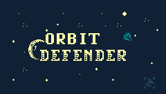

# Orbit Defender

## Table of Contents

- [About](#about)
- [How to install](#how-to-install)
- [Code reference](#code-reference)

## About
This is a game casually developed to learn TIC 80 using Lua.
To play a free online version of this game, visit the [cartrige page](https://tic80.com/play?cart=4360) in TIC-80's site.

## How to install

- Download and intall TIC-80 at [tic80.com](https://tic80.com).
- In TIC-80 terminal, navigate to the folder where you want to instal and run the command `folder` to open the folder in your computer.
- Open the folder in your terminal and clone this repository to it.
- Go back to TIC-80, enter the cloned folder and press esc to edit the code.
- More on how to use TIC-80 on [TIC-80 Wiki](https://github.com/nesbox/TIC-80/wiki).

## Code reference

### Game Stps
The game is devided in steps, controlled by the variable `step`. This variable holds an integer number and each number is a code that represents the game step as follows:

| Code | Step          |
|:-----|:--------------|
| 0    | Title Screen  |
| 1    | Ship Select   |
| 2    | Game          |
| 3    | Game Over     |
| 99   | Test          |

### Ship state
Every ship objetc has a `state` attribute. This atribute defines wether the ship is rising, getting hit, exploding... This attribute is managed by the `tic` method of the ship object (not to be confused with the native `TIC` function from TIC-80's API).
The states code are such as follows:

| Code | State     | 
|:-----|:-------   |
|0     | None      |
|1     | Rising    |
|2     | Flying    |
|3     | Hit       |
|4     | Exploding |

### Color options

|Color |HEX   |
|:-----|:-----|
|RED   |AA0000|
|PURPLE|AA00AA|
|PINK  |FF8888|
|GREEN |008080|
|BLUE  |0080A0|
|WHITE |CCCCCC|
|BLACK |555555|
|GRAY  |888888|
|ORANGE|FF8800|
|YELLOW|DDDD00|
